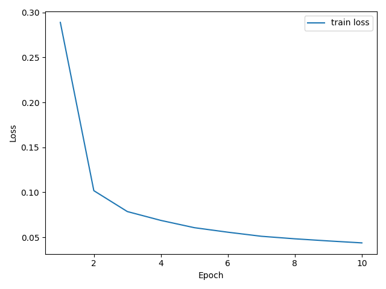
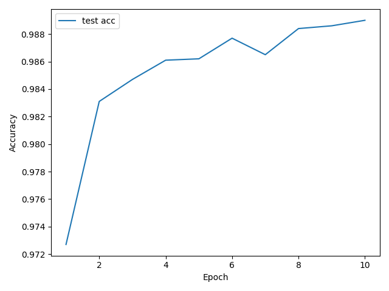

# CNN-from-Scratch 🧠🔥

This project implements a **Convolutional Neural Network (CNN)** trained on **MNIST**, built **completely from scratch** in **NumPy** (no PyTorch / TensorFlow).  
The goal is educational: to understand **how CNNs actually work under the hood**, by manually implementing forward & backward passes, parameter updates, and training loops.

---

## 📌 Problem Statement
We want to train a CNN on the **MNIST handwritten digits dataset** (28×28 grayscale images, 10 classes).  
The challenge is to implement everything ourselves:
- Convolution, pooling, fully connected, dropout, batchnorm
- Activation functions (ReLU, Softmax)
- Loss function (Cross-Entropy)
- Optimizers: **SGD, AdamW**
- Training loop with manual backpropagation
- Saving **loss & accuracy plots**

---

## 🏗 Model Architecture
Our CNN is small but effective:

Input: 1×28×28 (MNIST grayscale image)

[Conv2D] 1 → 32 filters (3×3)
[ReLU]
[MaxPool2D] (2×2)

[Conv2D] 32 → 64 filters (3×3)
[ReLU]
[MaxPool2D] (2×2)

[Flatten]
[Dropout (p=0.5)]
[Linear] 64×7×7 → 10 (class logits)

---

## 🧮 Mathematics Behind It

### Softmax + Cross-Entropy
For logits $z \in \mathbb{R}^{10}$ and one-hot label $y$:

$$
\text{softmax}(z)_i = \frac{e^{z_i}}{\sum_j e^{z_j}}
$$

$$
L = - \sum_i y_i \log \text{softmax}(z)_i
$$

Gradient wrt logits:

$$
\nabla_z L = \text{softmax}(z) - y
$$

---

### Backprop in CNN Layers
- **Conv2D:** compute gradients wrt filters via sliding window  
- **MaxPool2D:** pass gradient only to max locations  
- **ReLU:** derivative is $1$ for positive inputs, $0$ otherwise  
- **Linear:** classic $dW = x^T \nabla_z L$, $db = \sum \nabla_z L$

---

### Optimizers

**SGD + Momentum:**

$$
v \leftarrow \mu v + \nabla W
$$

$$
W \leftarrow W - \eta v
$$

**AdamW (decoupled weight decay):**

$$
m \leftarrow \beta_1 m + (1-\beta_1)\nabla W
$$

$$
v \leftarrow \beta_2 v + (1-\beta_2)\nabla W^2
$$

$$
W \leftarrow W - \eta \frac{\hat{m}}{\sqrt{\hat{v}}+\epsilon} - \eta \lambda W
$$

---

## 📊 Results
- Achieves **~98% accuracy on MNIST** with AdamW optimizer  
- Training plots are automatically saved in the `plots/` folder:
  - `train_loss.png`
  - `test_acc.png`

Example:

  


---

## ⚙️ How to Run

### 1. Clone repo
```bash
git clone https://github.com/anaslimem/CNN-from-Scratch
cd CNN-from-Scratch

```
### 2. Install dependencies
```bash
pip install numpy matplotlib

```
### 3. Run training
```bash
python train.py
```

---

This will:

- Train the CNN on MNIST
- Print loss & accuracy per epoch
- Save plots to plots/

---

## 📚 Learning Objectives

Understand how CNNs process images

Implement forward & backward propagation without autograd

Learn the differences between SGD vs AdamW optimizers

Appreciate the mechanics of convolution, pooling, and dropout

---
